# 🧠 Code Logic – DSA Practice App 🚀

Code Logic is a powerful mobile application designed to help students and developers improve their Data Structures & Algorithms (DSA) skills through structured learning, real-time practice, and performance tracking.

📱 **Available on Play Store:**
https://play.google.com/store/apps/details?id=com.vishnu.codelogic

---

## ✨ Features

* 📚 **DSA Practice Questions** – Solve curated problems
* 🏢 **Company-wise Questions** – Prepare for top tech companies
* 🛣️ **Structured Roadmap** – Step-by-step learning path
* 📅 **30 Days Challenge** – Daily guided practice plan
* 🧪 **Daily Mock Tests** – Improve speed & accuracy
* 🏆 **Leaderboard System** – Compete with other users
* 🎥 **YouTube Learning Integration** – Curated coding tutorials
* ⚡ Clean and user-friendly UI

---

## 🛠️ Tech Stack

* **Frontend:** Flutter
* **Backend:** Firebase
* **Database:** Firestore
* **Authentication:** Firebase Auth

---

## 📸 Screenshots

  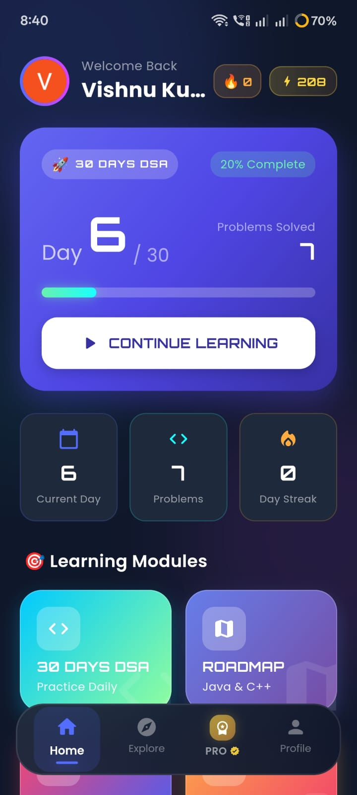
  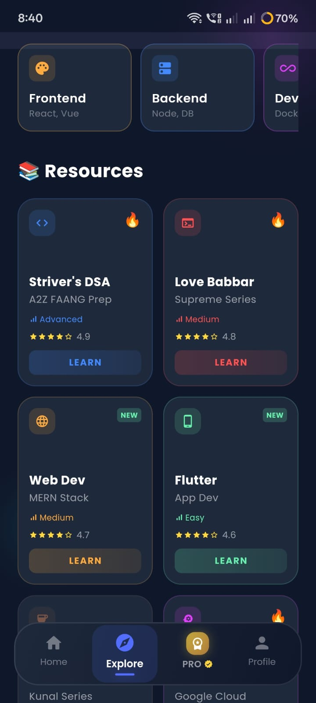
  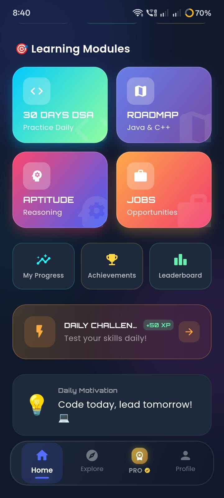

  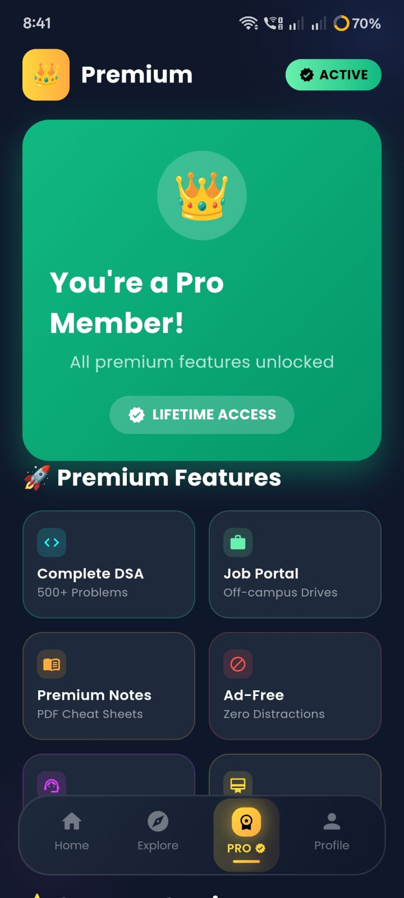
  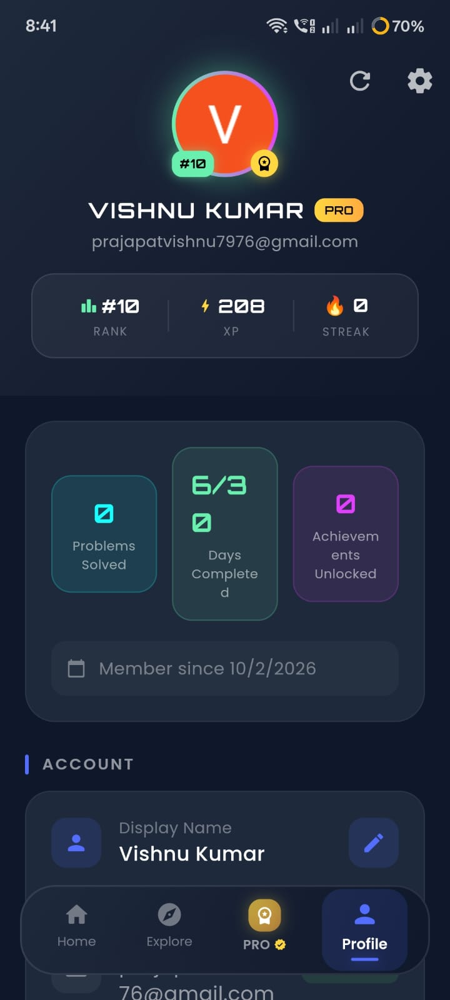
  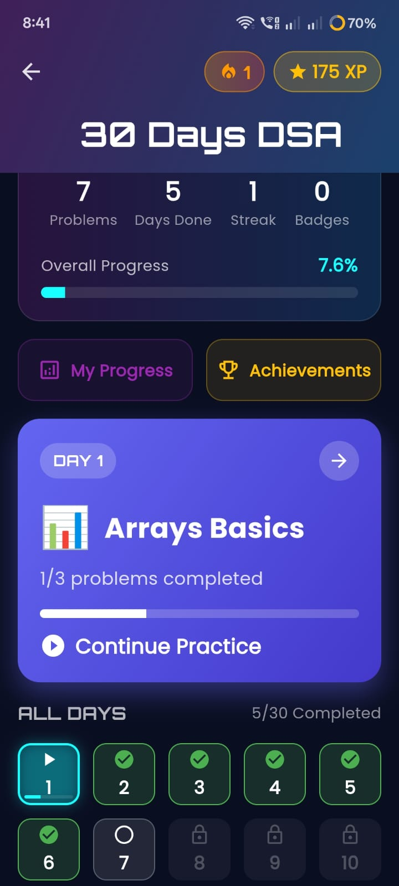

  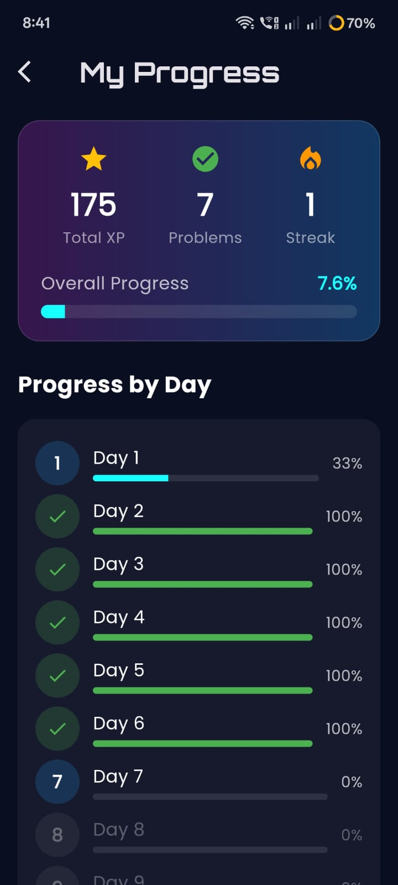
  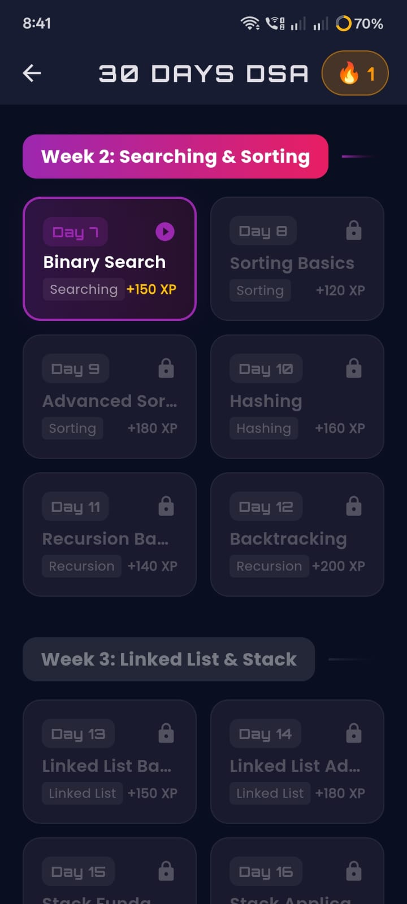
  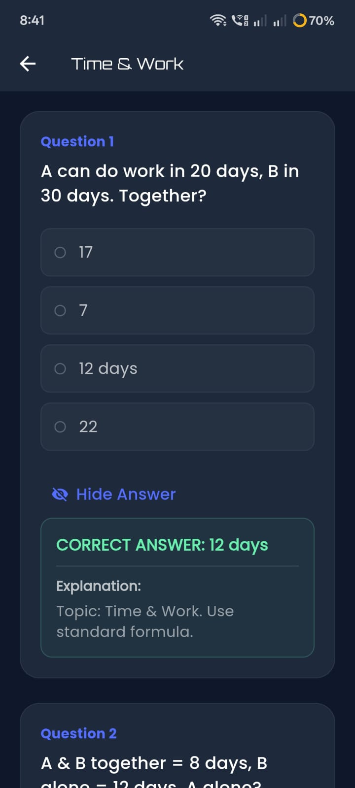

  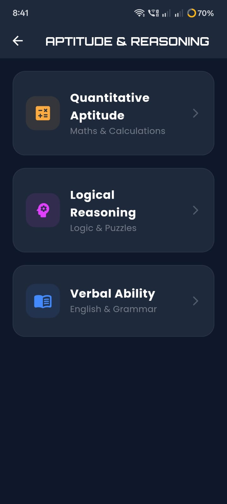
  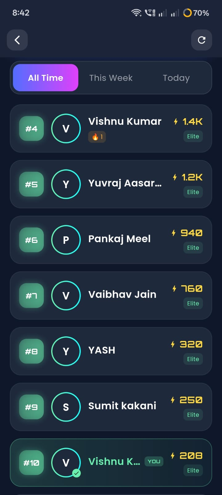

---

## 🚀 Project Highlights

* 📱 Live app published on Google Play Store
* 🎯 Focused on real-world DSA & interview preparation
* 📊 Combines learning + practice + evaluation
* 👨‍💻 Built for students targeting top tech companies

---

## 🔮 Future Improvements

* 📈 More advanced DSA problem sets
* 🤖 AI-based personalized recommendations
* 📊 Detailed performance analytics dashboard

---

## 📫 Connect With Me

* 💼 LinkedIn: https://www.linkedin.com/in/vishnu-kumar-545037327/
* 🌐 Portfolio: https://prajapatvishnu7976-sys.github.io/My-portfolio/

---

⭐ **"Practice. Learn. Improve. Repeat."**
